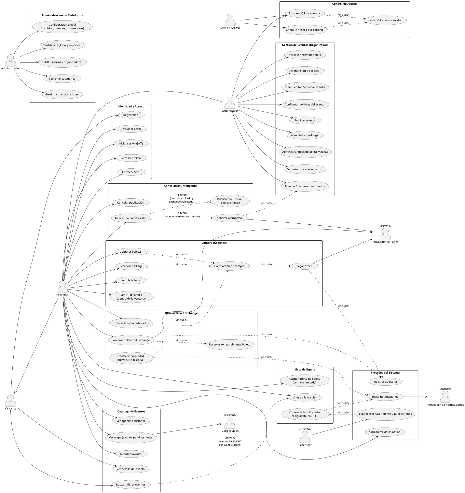
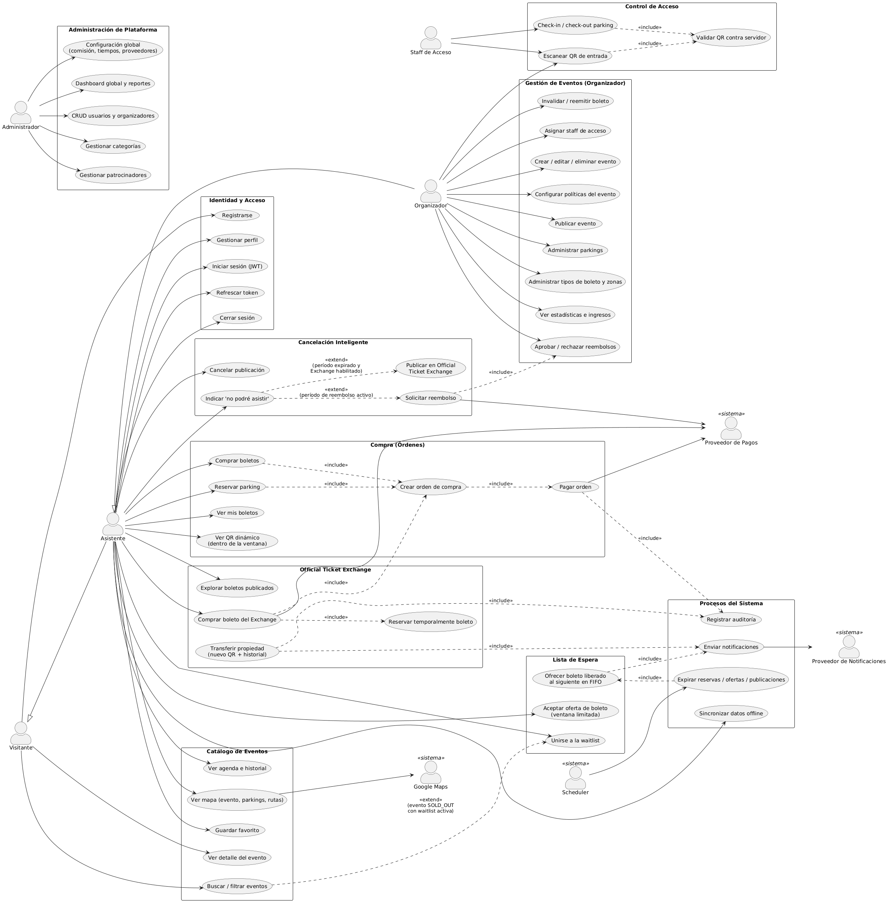

# EventFlow — Actores y Casos de Uso (UML)

## 1. Actores del sistema

### Actores humanos (primarios)

| Actor | Descripción | Hereda de |
|-------|-------------|-----------|
| **Visitante** | Usuario no autenticado. Solo puede explorar eventos públicos y registrarse. | — |
| **Asistente** | Usuario autenticado que compra boletos, reserva parking, usa el Exchange y la Waitlist. | Visitante |
| **Organizador** | Crea y administra eventos, políticas, boletos, parkings, zonas; ve estadísticas e ingresos; aprueba reembolsos. | Asistente |
| **Staff de Acceso** | Personal de puerta/parking asignado por un organizador a un evento. Permiso mínimo: escanear y validar QR de ese evento. *(Mejora — ADR-13)* | — |
| **Administrador** | Administra la plataforma: usuarios, organizadores, categorías, patrocinadores, configuración global, reportes. | — |

### Actores de sistema (secundarios)

| Actor | Rol |
|-------|-----|
| **Proveedor de Pagos** | Procesa cobros y devoluciones (Stripe/PayPal/Yappy/simulado, tras el puerto `PaymentProvider`). |
| **Proveedor de Notificaciones** | Push (FCM) / email. |
| **Google Maps** | Mapas, rutas y geolocalización en la app. |
| **Scheduler (Reloj)** | Dispara expiraciones: reservas temporales, ofertas de waitlist, publicaciones, QRs, transiciones de estado del evento. |

## 2. Diagrama de Casos de Uso (PlantUML)

> Renderizar con PlantUML (plugin de IntelliJ/VSCode o https://plantuml.com). Se agrupa por módulo para legibilidad; las relaciones `<<include>>`/`<<extend>>` marcan los flujos compuestos.

## 3. Notas de trazabilidad

- **UC30 (Cancelación inteligente)** es el punto de entrada único: el sistema evalúa `EventPolicy` + estado del boleto y ofrece **solo** la acción válida (reembolso *o* publicación, nunca ambas). Los `<<extend>>` reflejan esa exclusión mutua.
- **UC42 (Reserva temporal)** siempre precede a UC41: mientras exista una reserva activa, ningún otro usuario puede iniciar la compra del mismo boleto.
- **UC52 (Oferta a waitlist)** intercepta toda liberación de boleto (reembolso, cancelación, expiración de publicación) antes de que el boleto pueda publicarse en el Exchange.
- **UC61 (Validación server-side)** es obligatorio para todo escaneo: el dispositivo nunca decide por sí solo (prioridad de reglas #1 y #2).
- **UC90** materializa expiraciones basadas en `expires_at` (ADR-10); nunca es la única línea de defensa: cada lectura crítica también verifica expiración.

## 4. Matriz actor × módulo (resumen de permisos)

| Módulo | Visitante | Asistente | Staff | Organizador | Admin |
|---|---|---|---|---|---|
| Catálogo (lectura) | ✔ | ✔ | — | ✔ | ✔ |
| Órdenes / pagos | — | ✔ | — | ✔ (como comprador) | — |
| Exchange / Waitlist | — | ✔ | — | ✔ (config. por evento) | ✔ (comisión global) |
| Reembolsos | — | solicita | — | aprueba/rechaza | supervisa |
| Check-in | — | — | ✔ (evento asignado) | ✔ (sus eventos) | — |
| Gestión de eventos | — | — | — | ✔ (propios) | ✔ (todos) |
| Configuración global | — | — | — | — | ✔ |

Toda autorización se valida en el servidor con reglas por recurso (propiedad del boleto, evento del organizador, evento asignado al staff), no solo por rol.
