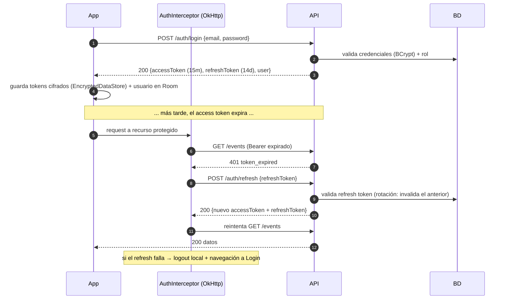
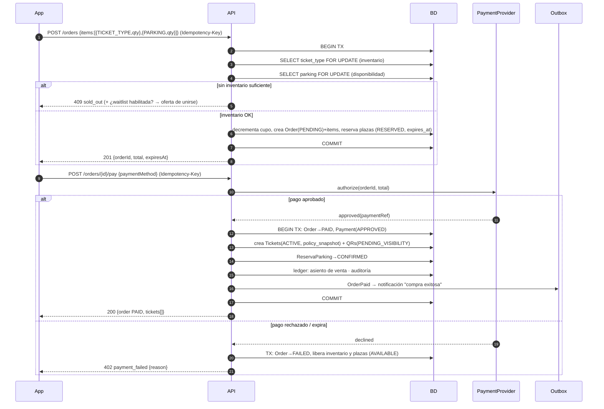
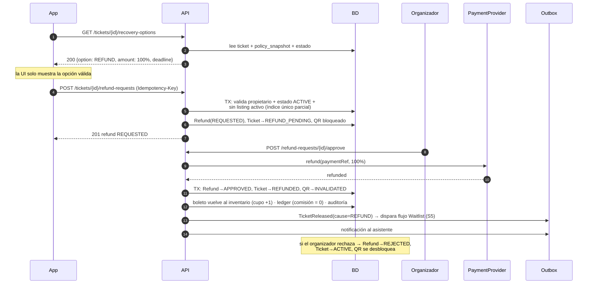
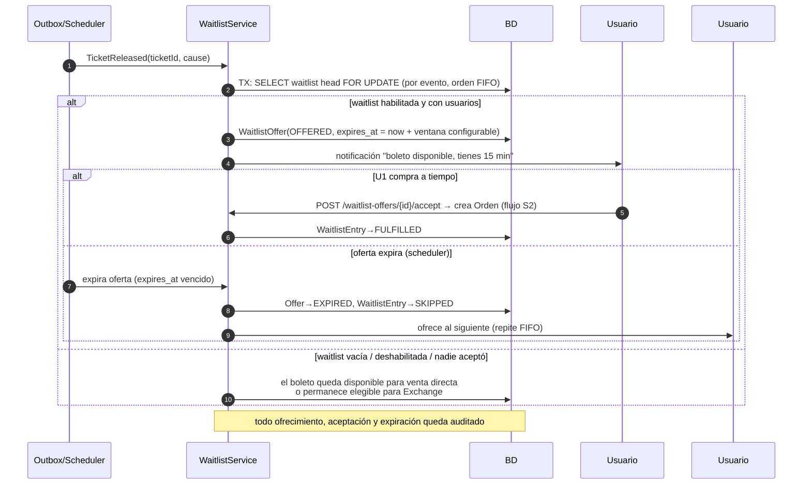

# EventFlow — Diagramas de Secuencia (flujos críticos)

> Diagramas en Mermaid (renderizan en VSCode/GitHub). Convenciones:
> - `App` = app Android (Compose + ViewModel + UseCase); `API` = Spring Boot; `BD` = PostgreSQL (Supabase).
> - Toda operación crítica lleva header `Idempotency-Key` (ADR-07).
> - `FOR UPDATE` indica bloqueo pesimista de fila (ADR-06). `Outbox` = evento de dominio persistido en la misma transacción (ADR-09).

## S1. Autenticación (login + refresh transparente)



## S2. Compra primaria de boletos (+ parking) mediante Orden



## S3. Cancelación inteligente → Reembolso (período activo)



## S4. Cancelación inteligente → Publicación en el Exchange (período expirado)

```mermaid
sequenceDiagram
    autonumber
    participant App
    participant API
    participant BD

    App->>API: GET /tickets/{id}/recovery-options
    API->>BD: policy_snapshot: reembolso expirado, exchange habilitado
    API-->>App: 200 {option: EXCHANGE, originalPrice: "80.00",<br/>depreciation: 10%, listPrice: "72.00"}
    Note over App: el precio lo calcula el servidor;<br/>el usuario solo confirma

    App->>API: POST /tickets/{id}/exchange-listings (Idempotency-Key)
    API->>BD: TX: valida propietario, estado ACTIVE, sin refund activo,<br/>exchange habilitado, fecha límite de publicación
    API->>BD: Listing(PUBLISHED, price="72.00" USD, expires_at),<br/>Ticket→PUBLISHED_IN_EXCHANGE, QR→BLOCKED
    API->>BD: auditoría
    API-->>App: 201 listing PUBLISHED
    Note over BD: el propietario NO cambia mientras esté publicado.<br/>Puede cancelar: Listing→CANCELLED, Ticket→ACTIVE, QR se desbloquea.
```

## S5. Liberación de boleto → Waitlist (FIFO) → Exchange



## S6. Compra en el Official Ticket Exchange (reserva temporal + transferencia)

```mermaid
sequenceDiagram
    autonumber
    participant Comprador as App (comprador)
    participant API
    participant BD
    participant Pay as PaymentProvider
    participant Vendedor as App (vendedor)

    Comprador->>API: POST /exchange-listings/{id}/reservations (Idempotency-Key)
    API->>BD: TX: SELECT listing FOR UPDATE
    alt listing PUBLISHED
        API->>BD: Listing→RESERVED, TemporalReservation(expires_at = now + t_config)
        API-->>Comprador: 201 {reservationId, price, expiresAt}
    else ya reservado/vendido
        API-->>Comprador: 409 listing_not_available
    end

    Comprador->>API: POST /orders {items:[{EXCHANGE_TICKET, reservationId}]} + pay
    API->>Pay: authorize(precio exchange)
    alt pago confirmado
        Pay-->>API: approved
        API->>BD: BEGIN TX (transferencia atómica)
        API->>BD: Ticket: owner → comprador (Ticket ID NO cambia)
        API->>BD: QR anterior → INVALIDATED · genera QR nuevo (único activo)
        API->>BD: TicketTransfer {precio original, valor exchange, depreciación,<br/>comisión, monto al vendedor, ambos propietarios, fecha/hora}
        API->>BD: ledger: comisión EventFlow + pago al vendedor
        API->>BD: Listing→SOLD · WaitlistEntry/Reservation cerradas · auditoría
        API->>BD: COMMIT
        API-->>Comprador: 200 boleto transferido (QR visible según ventana)
        API-->>Vendedor: notificación "boleto vendido, recibes $X"
    else pago falla o reserva expira
        API->>BD: TX: Reservation→EXPIRED/FAILED, Listing→PUBLISHED
        API-->>Comprador: 402 payment_failed
        Note over BD: el propietario nunca cambió; el QR sigue bloqueado<br/>mientras el listing esté publicado
    end
```

## S7. Check-in al evento (QR dinámico, validación server-side)

```mermaid
sequenceDiagram
    autonumber
    participant Staff as App Staff (escáner)
    participant API
    participant BD

    Note over Staff: el asistente muestra su QR<br/>(visible solo dentro de la ventana configurada)
    Staff->>API: POST /events/{id}/check-ins {qrToken} (Idempotency-Key)
    API->>API: verifica firma JWS (kid) + exp del token
    API->>BD: TX: SELECT qr JOIN ticket FOR UPDATE
    alt QR ACTIVO + ticket ACTIVE + propietario vigente + evento correcto + staff autorizado
        API->>BD: Ticket→USED, QR→CONSUMED, CheckIn registrado (+auditoría con dispositivo/IP)
        API-->>Staff: 200 ✅ {nombre, tipo de boleto, zona}
    else QR inválido / ya usado / bloqueado / de otro evento
        API->>BD: registra intento fallido (auditoría antifraude)
        API-->>Staff: 422 ❌ {código: qr_invalid | already_used | ticket_blocked}
    end
    Note over API: la decisión SIEMPRE es del servidor;<br/>el escáner solo muestra el resultado
```

## S8. Parking: reserva, entrada y salida

```mermaid
sequenceDiagram
    autonumber
    participant App
    participant API
    participant BD
    participant Staff as Escáner parking

    App->>API: POST /orders {items:[{PARKING, parkingId, type: VIP}]}
    API->>BD: TX: SELECT plazas disponibles FOR UPDATE
    API->>BD: Plaza AVAILABLE→RESERVED (con la orden, flujo S2)
    API-->>App: reserva confirmada + QR de parking

    Note over Staff: llegada al evento
    Staff->>API: POST /parkings/{id}/check-ins {qrToken}
    API->>BD: TX: valida QR + reserva → Plaza RESERVED→OCCUPIED
    API-->>Staff: 200 ✅ plaza asignada

    Note over Staff: salida
    Staff->>API: POST /parkings/{id}/check-outs {qrToken}
    API->>BD: TX: Plaza OCCUPIED→AVAILABLE · registra salida (auditoría)
    API-->>Staff: 200 ✅
    Note over BD: OUT_OF_SERVICE/BLOCKED solo por acción del organizador;<br/>una reserva no usada expira → Plaza vuelve a AVAILABLE (scheduler)
```

## Invariantes que estos flujos garantizan

1. **Nunca hay dos QR activos para un boleto** (índice único parcial + transacción de transferencia).
2. **Nunca hay reembolso y publicación simultáneos** (validación cruzada en TX + índices únicos parciales).
3. **El propietario solo cambia con pago confirmado** (S2/S6: la transferencia vive dentro de la transacción post-confirmación).
4. **La Waitlist siempre tiene prioridad sobre el Exchange** al liberarse un boleto (S3→S5).
5. **Dos compradores no pueden ganar el mismo boleto/plaza** (`FOR UPDATE` en la fila caliente).
6. **Reintentos de red no duplican efectos** (`Idempotency-Key` en compras, pagos, reembolsos, check-ins).
