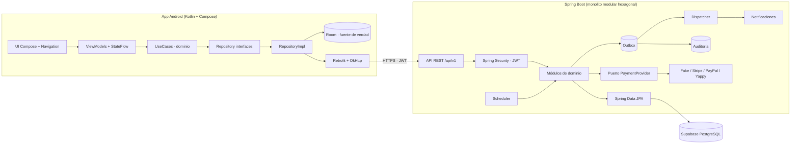

# EventFlow — Arquitectura y Estructura de Carpetas

## 1. Vista general



Regla de oro (requisito de dominio): **las reglas de negocio viven en el dominio del backend**. Los ViewModels de Android y los Controllers de Spring solo orquestan. La app **nunca** decide sobre estado de negocio con datos locales; Room es caché/soporte offline, no autoridad.

## 2. Backend — monolito modular hexagonal (ADR-01)

### 2.1 Estructura de carpetas

```text
backend/
├── build.gradle.kts (o pom.xml)
└── src/main/java/com/eventflow/
    ├── EventFlowApplication.java
    ├── shared/                        # Kernel compartido (sin dependencias hacia módulos)
    │   ├── domain/                    # Money, DomainEvent, AggregateRoot, AuditableEntity
    │   ├── error/                     # jerarquía de excepciones de dominio, ProblemDetail mapper
    │   ├── idempotency/               # filtro + repositorio de Idempotency-Key
    │   ├── outbox/                    # entidad outbox, dispatcher, publicador
    │   └── security/                  # JWT provider, filtros, anotaciones de autorización
    ├── config/                        # Security, JPA, Scheduler, OpenAPI, CORS
    └── modules/
        ├── identity/                  # usuarios, roles, auth, refresh tokens
        ├── catalog/                   # eventos, EventPolicy, categorías, patrocinadores, zonas
        ├── ticketing/                 # TicketType, Ticket, QRDinamico, HistorialTicket
        ├── ordering/                  # Order, OrderItem (TICKET | PARKING | EXCHANGE_TICKET)
        ├── payments/                  # Payment, puerto PaymentProvider + adaptadores
        ├── exchange/                  # ExchangeListing, TemporalReservation, TicketTransfer
        ├── waitlist/                  # WaitlistEntry, WaitlistOffer
        ├── refunds/                   # RefundRequest
        ├── parking/                   # Parking, ParkingSlot, ReservaParking, check-in/out
        ├── checkin/                   # CheckInEvento, asignación de staff
        ├── notifications/             # plantillas, puerto NotificationProvider (FCM/email)
        ├── analytics/                 # queries de dashboard (lee ledger + vistas)
        ├── ledger/                    # asientos económicos inmutables
        ├── platformconfig/            # ConfiguracionGlobal (comisión, tiempos, proveedores)
        └── audit/                     # consumidor de eventos → registros de auditoría
```

### 2.2 Anatomía de un módulo (hexagonal ligero)

```text
modules/exchange/
├── domain/                # PURO: entidades, value objects, máquina de estados, reglas
│   ├── ExchangeListing.java
│   ├── ListingStatus.java
│   ├── ExchangePricing.java          # cálculo precio = original × (1 − depreciación)
│   └── event/ListingPublished.java   # eventos de dominio
├── application/           # casos de uso transaccionales (services)
│   ├── PublishTicketUseCase.java
│   ├── ReserveListingUseCase.java
│   └── CompleteTransferUseCase.java
├── infrastructure/        # JPA repositories, adaptadores, scheduler handlers
└── api/                   # controllers + DTOs (request/response records) + mappers
```

Reglas de dependencia: `api → application → domain` y `infrastructure → domain`. **`domain` no importa Spring ni JPA-específicos** (se admite JPA en entidades por pragmatismo de proyecto, pero las reglas de negocio son métodos del agregado, testeables sin contexto de Spring). Comunicación **entre módulos**: interfaces públicas de `application` o eventos de dominio vía outbox — nunca tocando repositorios de otro módulo.

### 2.3 Transversales

| Concern | Mecanismo |
|---|---|
| Autenticación | JWT access (corto) + refresh con **rotación** (el refresh usado se invalida). Filtro `JwtAuthenticationFilter`. |
| Autorización | Roles (`ADMIN/ORGANIZER/STAFF/ATTENDEE`) + **verificación por recurso** en application layer (propietario del ticket, dueño del evento, staff asignado). |
| Idempotencia | Header `Idempotency-Key` (UUID) en POSTs críticos; tabla persiste clave + hash del request + respuesta; repetición ⇒ misma respuesta, sin re-ejecución. |
| Concurrencia | `@Version` en agregados editables (Event, EventPolicy) → `409 conflict` en edición simultánea; `SELECT … FOR UPDATE` en inventario, listing, plaza, oferta waitlist, QR en check-in. |
| Expiraciones | `expires_at` en la fila + `@Scheduled` que barre y transiciona; toda lectura crítica revalida `expires_at` (ADR-10). |
| Eventos/notificaciones/auditoría | Outbox en la misma TX → dispatcher asíncrono → NotificationProvider y Audit (ADR-09). |
| Errores | `@ControllerAdvice` + envelope de error uniforme (ver doc 05); nunca filtrar detalles internos. |
| Validación | Bean Validation en DTOs (borde) + invariantes en el dominio (defensa en profundidad). |
| Rate limiting | Filtro Bucket4j en `/auth/**` y endpoints de compra. |
| Documentación | springdoc-openapi → `/swagger-ui`. |

### 2.4 Catálogo de Domain Events (ADR-18)

Nombres en pasado, payload versionado (`eventVersion`), publicados en la misma transacción vía outbox. Nunca se llama a auditoría/notificaciones/estadísticas directamente desde un caso de uso.

| Módulo emisor | Eventos |
|---|---|
| ordering / payments | `OrderCreated`, `PaymentConfirmed`, `PaymentFailed`, `OrderCancelled` |
| ticketing | `TicketPurchased`, `TicketInvalidated`, `TicketReissued`, `QRCodeGenerated`, `QRCodeInvalidated` |
| exchange | `TicketPublished`, `TicketUnpublished`, `ListingReserved`, `ListingExpired`, `TicketTransferred` |
| refunds | `RefundRequested`, `RefundApproved`, `RefundRejected`, `TicketRefunded` |
| waitlist | `WaitlistJoined`, `WaitlistOfferMade`, `WaitlistOfferExpired`, `WaitlistFulfilled` |
| parking | `ParkingReserved`, `ParkingOccupied`, `ParkingReleased` |
| checkin | `CheckInCompleted`, `CheckInDenied` |
| ticketing/exchange/refunds | `TicketReleased(cause)` — evento integrador que dispara la prioridad de la Waitlist (S5) |

Consumidores estándar de todo evento: **audit** (registro obligatorio), **notifications** (según plantilla), **analytics** (proyecciones del dashboard). Agregar un consumidor nuevo no modifica los emisores.

### 2.5 Diseño del QR dinámico (ADR-08)

- El QR codifica un **JWS compacto**: `{ qr_id (UUID), kid, exp }` firmado con ES256. **Nada más** — sin userId, sin ticketId, sin precios.
- Tabla `dynamic_qrs`: `id, ticket_id, status (ACTIVE|BLOCKED|INVALIDATED|CONSUMED|EXPIRED), issued_at, expires_at, key_id`.
- **Índice único parcial**: `UNIQUE (ticket_id) WHERE status IN ('ACTIVE','BLOCKED')` ⇒ imposible tener dos QR vigentes.
- Visibilidad: el endpoint `GET /tickets/{id}/qr` responde `403 qr_not_yet_visible` fuera de la ventana configurada por el organizador; la app muestra cuenta regresiva.
- Regeneración automática (transferencia, reembolso, reemisión, retorno al dueño): dentro de la misma transacción se invalida el anterior y se emite el nuevo.
- Validación de check-in: firma → estado en BD → propietario → evento → ventana temporal. El QR jamás se valida offline.
- Rotación de llaves: `kid` permite tener llaves activas y retiradas sin invalidar QRs en circulación.

## 3. Android — Clean Architecture + offline-first (ADR-12)

### 3.1 Estructura de paquetes

Proyecto de un solo módulo Gradle con separación estricta por paquetes (modularizable a `:domain`, `:data`, etc. si el equipo crece):

```text
app/src/main/java/com/app/eventflow/
├── EventFlowApp.kt                    # @HiltAndroidApp
├── MainActivity.kt
├── core/
│   ├── di/                            # módulos Hilt (network, database, dispatchers)
│   ├── network/                       # AuthInterceptor, TokenAuthenticator, ApiEnvelope
│   ├── database/                      # EventFlowDatabase, converters
│   ├── security/                      # EncryptedDataStore (tokens)
│   ├── sync/                          # SyncManager (WorkManager), ConnectivityObserver
│   └── util/                          # AppResult<T>, AppError, formatters
├── domain/                            # PURO Kotlin (sin Android/Retrofit/Room)
│   ├── model/                         # Event, Ticket, Order, ParkingReservation, ...
│   ├── repository/                    # interfaces
│   └── usecase/                       # por feature: auth/, events/, tickets/, exchange/, ...
├── data/
│   ├── remote/
│   │   ├── api/                       # interfaces Retrofit por módulo
│   │   └── dto/                       # DTOs espejo del contrato (doc 05)
│   ├── local/
│   │   ├── dao/                       # DAOs Room
│   │   └── entity/                    # entidades Room
│   ├── mapper/                        # Dto↔Entity↔Domain (funciones de extensión)
│   └── repository/                    # implementaciones (coordinan remote+local)
└── ui/
    ├── theme/                         # Material 3 (ya existe)
    ├── navigation/                    # NavHost, rutas tipadas, grafos por rol
    ├── components/                    # composables reutilizables
    └── feature/
        ├── auth/          (login, register)
        ├── events/        (lista, detalle, búsqueda, filtros, mapa)
        ├── tickets/       (mis boletos, QR con countdown, cancelación inteligente)
        ├── exchange/      (explorar, publicar, comprar)
        ├── waitlist/
        ├── orders/        (checkout, historial)
        ├── parking/
        ├── favorites/
        ├── notifications/
        ├── profile/
        ├── organizer/     (dashboard, CRUD evento, políticas, escáner QR, stats)
        └── admin/         (usuarios, categorías, patrocinadores, config global)
```

### 3.2 Flujo de datos y offline

- **Lecturas**: `Repository` expone `Flow` desde Room (fuente de verdad de la UI) y refresca desde la API en segundo plano (*stale-while-revalidate*). Sin red ⇒ la app sigue mostrando eventos consultados, boletos, reservas, favoritos e historial.
- **Escrituras críticas** (comprar, pagar, publicar, reembolsar, check-in): **requieren red**; jamás se encolan offline (prioridad seguridad/integridad). La UI lo comunica claramente.
- **Escrituras tolerantes** (favoritos, preferencias de notificación): patrón de cola de sincronización con WorkManager; el servidor gana en conflicto.
- **Sync al recuperar conexión**: `SyncManager` refresca boletos/QRs/órdenes activas (el estado de un boleto pudo cambiar mientras el dispositivo estaba offline).
- **Tokens**: en `EncryptedDataStore` (Jetpack Security), nunca en Room plano.
- **Estado de UI**: cada pantalla con `data class XxxUiState` inmutable expuesto por `StateFlow`; eventos one-shot con `Channel`.

### 3.3 Manejo de errores en la app

`AppResult<T> = Success | Failure(AppError)` con `AppError = Network | Http(code, apiCode) | Auth | Validation | Unknown`. El mapper de red traduce el envelope de error de la API (doc 05) a mensajes amigables; los ViewModels solo mapean `AppError → UiState`.

## 4. Escalabilidad y migración futura

- **Web/iOS/Desktop**: consumen la misma API v1; ninguna regla vive en el cliente.
- **Microservicios**: cada módulo ya tiene frontera (API pública de application + eventos outbox). Extraer = mover módulo + convertir eventos outbox en mensajes de broker.
- **Reportes**: el dashboard lee del **ledger** y de vistas materializadas, no de las tablas transaccionales calientes.
