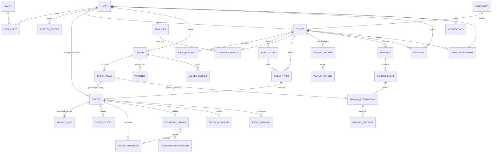
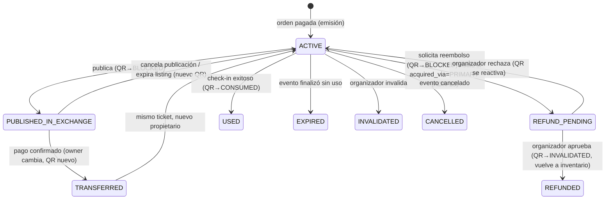

# EventFlow — Modelo de Datos (DDD + PostgreSQL)

> **Nota de vigencia:** el diccionario físico autoritativo vive en `docs/design/db/` (serie 07, corregida por la auditoría 08). Este documento conserva la vista de dominio: ER conceptual, máquinas de estado y defensas de integridad.

> Convenciones: PK = `id UUID` (ADR-15) · dinero como VO `Money` → columnas `*_amount NUMERIC(12,2)` + `currency CHAR(3)` (ADR-05; en este documento los campos monetarios se anotan `*_price`/`*_amount`) · timestamps `TIMESTAMPTZ` en UTC (ADR-17) · `version INT` para bloqueo optimista donde aplica · **Soft Delete** (ADR-16): `deleted_at TIMESTAMPTZ NULL` en `users`, `events`, `tickets`, `orders`, `payments`, `refund_requests`; los índices únicos de esas tablas son parciales con `WHERE deleted_at IS NULL` · snake_case en BD.

## 1. Diagrama Entidad-Relación (núcleo)

## 2. Entidades por módulo

### identity
- **users**: `id, email, password_hash, full_name, phone, status, created_at, deleted_at` · `UNIQUE(email) WHERE deleted_at IS NULL`
- **roles** / **user_roles**: `ADMIN | ORGANIZER | STAFF | ATTENDEE` (un usuario puede tener varios)
- **refresh_tokens**: `id, user_id, token_hash, expires_at, revoked_at, replaced_by` (rotación)
- **staff_assignments**: `event_id, user_id, permissions` — habilita al STAFF a escanear solo su evento

### catalog
- **events**: `id, organizer_id, category_id, title, description, venue_name, latitude, longitude, starts_at, ends_at, status, cover_url, version` · estados: `DRAFT → PUBLISHED → (SOLD_OUT ⇄ PUBLISHED) → IN_PROGRESS → FINISHED`, más `CANCELLED`, `SUSPENDED`
- **event_policies** (1:1 con events, ADR-02): `event_id PK/FK, refund_window_ends_at, refund_pct (100 fijo por política económica), exchange_enabled, exchange_depreciation_pct, exchange_listing_deadline, waitlist_enabled, waitlist_offer_minutes, temp_reservation_minutes, qr_visibility_hours_before, qr_expiration_minutes, cancellation_policy TEXT, extra_policies JSONB, version`
- **categories**, **sponsors**, **sponsors_events**, **event_zones** (`name, capacity`)

### ticketing
- **ticket_types**: `id, event_id, zone_id, name, price, currency, total_quantity, sold_quantity, sales_start/end, version` — el inventario vive aquí
- **tickets**: `id (permanente), ticket_type_id, event_id, current_owner_id, source_order_item_id, acquisition_order_item_id, acquired_via (PRIMARY|EXCHANGE, ADR-19), status, original_price, acquisition_price (base del reembolso, C2), policy_snapshot JSONB (ADR-03), purchased_at, version` · estados: ver §3
- **dynamic_qrs**: `id, subject_type (TICKET|PARKING), ticket_id?, parking_reservation_id?, status, key_id, issued_at, expires_at` · **`UNIQUE(ticket_id) WHERE status IN ('ACTIVE','BLOCKED')`** y equivalente por reserva de parking (generalizado en auditoría I2)
- **ticket_history**: `id, ticket_id, from_status, to_status, actor_id, cause, occurred_at` — nunca se borra

### ordering / payments / ledger
- **orders**: `id, buyer_id, status (PENDING|PAID|FAILED|CANCELLED|REFUNDED), total_amount, currency, expires_at, idempotency_key`
- **order_items**: `id, order_id, item_type (TICKET|PARKING|EXCHANGE_TICKET), ticket_type_id?, parking_id?, temporal_reservation_id? (FKs tipadas + CHECK exactamente-una, auditoría I1), quantity, unit_price`
- **payments**: `id, order_id, provider, provider_ref, status (PENDING|APPROVED|DECLINED|REFUNDED), amount, created_at`
- **ledger_entries** (inmutables, partida doble — ADR-14): `id, entry_type (SALE|EXCHANGE_SALE|PLATFORM_FEE|SELLER_PAYOUT|REFUND|PARKING_SALE), source_account, destination_account (BUYER:<uuid> | SELLER:<uuid> | PLATFORM | ORGANIZER:<uuid>), amount NUMERIC(12,2), currency, fee_amount, reference_type + reference_id (orden/transferencia/reembolso), event_id, occurred_at, details JSONB` — sin `UPDATE`/`DELETE` (privilegios de BD lo impiden: `REVOKE UPDATE, DELETE`)

### exchange / waitlist / refunds
- **exchange_listings**: `id, ticket_id, seller_id, original_price, list_price (calculado por el sistema, CHECK ≤ original), depreciation_pct, status (WAITLIST_HOLD|PUBLISHED|RESERVED|SOLD|CANCELLED|EXPIRED), expires_at` · **`UNIQUE(ticket_id) WHERE status IN ('WAITLIST_HOLD','PUBLISHED','RESERVED')`**
- **temporal_reservations**: `id, listing_id, buyer_id, status (ACTIVE|COMPLETED|EXPIRED|FAILED), expires_at` · `UNIQUE(listing_id) WHERE status='ACTIVE'`
- **ticket_transfers**: `id, ticket_id, listing_id, from_owner_id, to_owner_id, original_price, exchange_price, depreciation_pct, fee_amount, seller_amount, transferred_at` — registro completo exigido por la política de comisiones
- **waitlist_entries**: `id, event_id, user_id, queue_seq (BIGINT monótono inmutable — FIFO sin renumeración, auditoría I3), status (WAITING|OFFERED|FULFILLED|SKIPPED|CANCELLED), joined_at` · `UNIQUE(event_id, user_id) WHERE status IN ('WAITING','OFFERED')`
- **waitlist_offers**: `id, entry_id, source_type (INVENTORY|EXCHANGE), ticket_type_id?, listing_id? (fuente polimórfica + CHECK exactamente-una, auditoría C1), status (OFFERED|ACCEPTED|EXPIRED|DECLINED), expires_at`
- **refund_requests**: `id, ticket_id, requester_id, payment_id (pago de adquisición, C2/A7), amount (= acquisition_price congelado), status (REQUESTED|APPROVED|REJECTED|CANCELLED), resolved_by, resolved_at, reason` · **`UNIQUE(ticket_id) WHERE status='REQUESTED'`** · solo `acquired_via=PRIMARY` (ADR-19)

### parking / checkin
- **parkings**: `id, event_id, name, type (VIP|GENERAL|STAFF|MOTO|ACCESSIBLE), total_slots, price, opens_at, closes_at, version`
- **parking_slots**: `id, parking_id, code, status (AVAILABLE|RESERVED|OCCUPIED|OUT_OF_SERVICE|BLOCKED), version`
- **parking_reservations**: `id, slot_id, order_item_id, user_id, status, expires_at` (su QR vive en `dynamic_qrs` con `subject_type=PARKING`, auditoría I2)
- **event_checkins** / **parking_checkins**: `id, ticket_id/reservation_id, scanned_by, device_info, ip, occurred_at, result (GRANTED|DENIED), denial_reason`

### plataforma
- **global_config**: `key PK, value JSONB, updated_by, updated_at` — comisión exchange, tiempos por defecto, proveedores habilitados
- **idempotency_keys**: `key PK, user_id, endpoint, request_hash, response_status, response_body JSONB, created_at`
- **outbox_events**: `id, aggregate_type, aggregate_id, event_type, payload JSONB, status (PENDING|PROCESSED|FAILED), created_at, processed_at`
- **audit_log**: `id, actor_id, action, entity_type, entity_id, ip, device, details JSONB, occurred_at` — poblado por el consumidor del outbox
- **favorites**, **notifications** (`user_id, type, title, body, read_at, payload JSONB`)

## 3. Máquinas de estado (dominio)

### Ticket

Reglas imposibles por diseño: `USED`, `REFUNDED`, `EXPIRED`, `INVALIDATED`, `CANCELLED` son **terminales** → un boleto usado jamás se revende; uno reembolsado jamás se publica.

### Order
`PENDING → PAID | FAILED | CANCELLED` · `PAID → REFUNDED` (parcial por ítem se registra en ledger).

### ExchangeListing
`WAITLIST_HOLD → PUBLISHED` (waitlist agotada/deshabilitada o nadie aceptó) · `WAITLIST_HOLD → SOLD` (compró alguien de la fila) · `PUBLISHED → RESERVED → SOLD` · `RESERVED → PUBLISHED` (pago falla/expira) · `WAITLIST_HOLD | PUBLISHED → CANCELLED | EXPIRED`. El estado inicial es `WAITLIST_HOLD` si el evento tiene waitlist habilitada con usuarios en espera; `PUBLISHED` en caso contrario (auditoría 08, A1).

### Regla ADR-19 (oficial)
Un boleto con `acquired_via = 'EXCHANGE'` jamás transiciona a `REFUND_PENDING`; su única recuperación es re-publicar. `recovery-options` devuelve `EXCHANGE` o `NONE` para esos boletos.

### ParkingSlot
`AVAILABLE → RESERVED → OCCUPIED → AVAILABLE` · `RESERVED → AVAILABLE` (expiración) · `cualquiera → OUT_OF_SERVICE | BLOCKED` (solo organizador) y retorno manual a `AVAILABLE`.

### WaitlistEntry / Offer
`WAITING → OFFERED → FULFILLED` · `OFFERED → SKIPPED` (expiró) → se ofrece al siguiente `WAITING` por `position`.

## 4. Integridad y concurrencia en BD

| Riesgo | Defensa |
|---|---|
| Dos QR vigentes para un ticket | Índice único parcial en `dynamic_qrs` |
| Reembolso + publicación simultáneos | Índices únicos parciales en `refund_requests` y `exchange_listings` + verificación cruzada en la misma TX |
| Sobreventa de inventario | `SELECT … FOR UPDATE` sobre `ticket_types` + `CHECK (sold_quantity <= total_quantity)` |
| Doble compra del mismo listing | `FOR UPDATE` sobre el listing + único parcial en `temporal_reservations` |
| Doble reserva de plaza | `FOR UPDATE` sobre `parking_slots` |
| Doble check-in | `FOR UPDATE` sobre el QR + estado terminal `CONSUMED` |
| Ediciones concurrentes de evento/política | `version` (optimista) → 409 al cliente |
| Reintentos de red | `idempotency_keys` |
| Dos reservas temporales vigentes sobre un boleto | `UNIQUE(listing_id) WHERE status='ACTIVE'` + `UNIQUE(ticket_id) WHERE status IN ('PUBLISHED','RESERVED')` en listings: la cadena garantiza a lo sumo una reserva activa por ticket |
| Más de un propietario vigente | `tickets.current_owner_id` es una sola columna; el historial de propietarios vive en `ticket_transfers`/`ticket_history`, nunca como filas "activas" paralelas |
| Borrado que rompe trazabilidad | Soft Delete (`deleted_at`) en entidades críticas; `ledger_entries`, `ticket_history`, `ticket_transfers`, `audit_log` sin privilegios de `UPDATE/DELETE` |
| Pérdida de historial | `ticket_history`, `ticket_transfers`, `audit_log`, `ledger_entries` son *append-only* |

Índices adicionales: `events(status, starts_at)`, `tickets(current_owner_id, status)`, `waitlist_entries(event_id, status, position)`, `outbox_events(status, created_at)`, búsquedas de catálogo con `GIN` sobre `to_tsvector(title || description)`.
