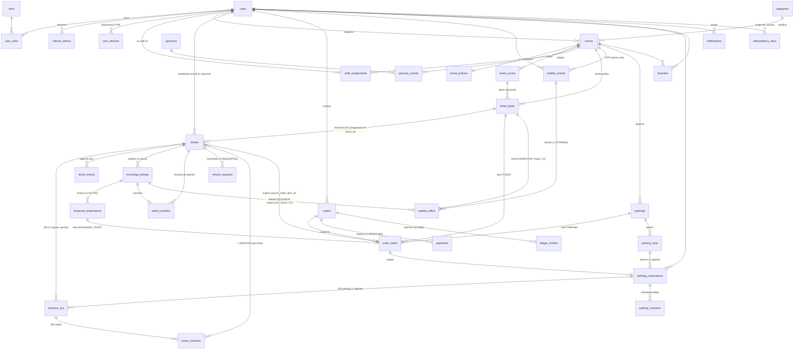

# EventFlow BD — 2. Diagrama Entidad-Relación (físico)

> Organización física en **schemas PostgreSQL por módulo** (mejora propuesta, ver 07-bd-07 §3): `identity`, `catalog`, `ticketing`, `commerce`, `parking`, `ops`. Los FKs cruzan schemas sin costo; cada schema espeja un módulo del monolito y delimita una futura extracción a microservicio.

## Distribución tabla → schema

| Schema | Tablas |
|---|---|
| `identity` | users, roles, user_roles, refresh_tokens, user_devices, staff_assignments |
| `catalog` | categories, events, event_policies, event_zones, sponsors, sponsor_events |
| `ticketing` | ticket_types, tickets, ticket_history, dynamic_qrs |
| `commerce` | orders, order_items, payments, ledger_entries, exchange_listings, temporal_reservations, ticket_transfers, waitlist_entries, waitlist_offers, refund_requests |
| `parking` | parkings, parking_slots, parking_reservations |
| `ops` | event_checkins, parking_checkins, favorites, notifications, global_config, idempotency_keys, outbox_events, audit_log |

Tablas append-only (sin `UPDATE`/`DELETE`, revocado a nivel de privilegios): `ticket_history`, `ticket_transfers`, `ledger_entries`, `event_checkins`, `parking_checkins`, `audit_log`.
